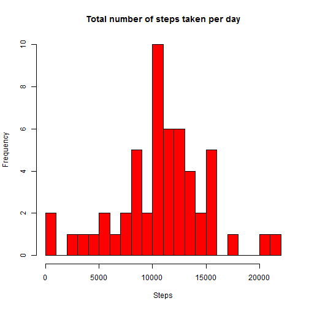
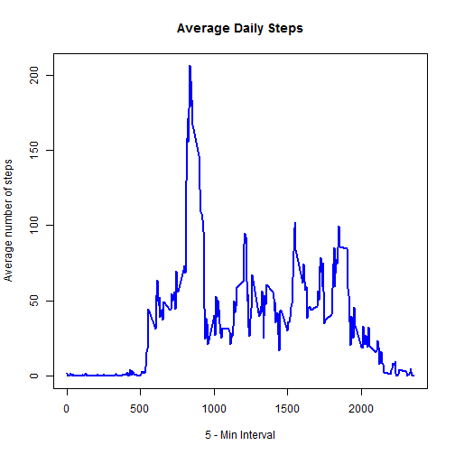
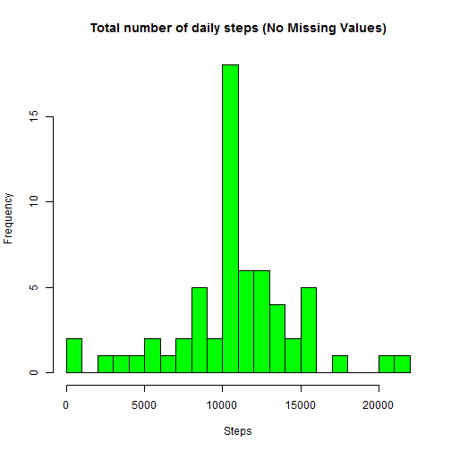
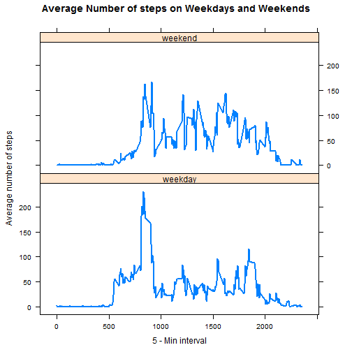

# Reproducible Research - Course project 1

## Downloading the data

```r
if(!file.exists ('data')) dir.create ('data')  
fileUrl <- "https://d396qusza40orc.cloudfront.net/repdata%2Fdata%2Factivity.zip"  
download.file(fileUrl, destfile = './data/activity_monitoring_data.zip')  
unzip('./data/activity_monitoring_data.zip', exdir = './data')
```

## 1. Loading the data

```r
activity <- read.csv('./data/activity.csv')  
```

## 1.1 Formatting the data

```r
activity$date <- as.Date(activity$date, format = "%Y-%m-%d")
```

## 2. Total number of steps taken per day

```r
totalSteps <- aggregate(steps ~ date, data = activity, sum, na.rm = TRUE)
```

## 2.1 Histogram of total number of steps taken per day

```r
par(mfrow = c(1, 1))  
hist(totalSteps$steps, breaks = 20, main = "Total number of steps taken per day", col = "red", xlab = "Steps")
```



## 2.2 Mean and Median of total number of steps taken per day

```r
mean(totalSteps$steps)
```

```
## [1] 10766.19
```


```r
median(totalSteps$steps)
```

```
## [1] 10765
```

## 3. Average daily activity pattern

```r
averageSteps <- aggregate(steps ~ interval, data = activity, mean, na.rm = TRUE)  
plot(averageSteps$interval, averageSteps$steps, type = "l", lwd = 2, main = "Average Daily Steps", col = "blue", xlab = "5 - Min Interval", ylab = "Average number of steps")
```



## 3.1 Maximum steps

```r
averageSteps$interval[which.max(averageSteps$steps)]
```

```
## [1] 835
```

## 4. Missing values in the data
## 4.1 Total number of missing values in the dataset


```r
dim(activity[activity$steps == "NA", ])
```

```
## [1] 2304    3
```

## 4.2 Filling in missing values in the data with the mean of 5 Mins intervals

```r
NoMissing <- activity  
for (i in averageSteps$interval) { 
NoMissing[NoMissing$interval == i & is.na(NoMissing$steps), ]$steps <- averageSteps$steps[averageSteps$interval == i]
}
```
## 4.3 Histogram with no missing values, with mean and median

```r
totalStepsNoMissing <- aggregate(steps ~ date, data = NoMissing, sum, na.rm = TRUE)  
hist(totalStepsNoMissing$steps, breaks = 20, main = "Total number of daily steps (No Missing Values)", col = "green", xlab = "Steps")  
```



```r
mean(totalStepsNoMissing$steps)
```

```
## [1] 10766.19
```

```r
median(totalStepsNoMissing$steps)
```

```
## [1] 10766.19
```
### The mean for both datasets with and without missing values is the same, i.e. 10766.19. The median is slightly different, with median with missing values being 10765, whereas the median without missing values is 10766.19. Missing values have been imputed using the mean of the 5-min intervals, which results in more data points equal to the mean and reduces variation. This also results in the median being the same as previously.

## 5. Activity patterns on Weekdays and Weekends

```r
NoMissing$day <- weekdays(NoMissing$date)  
NoMissing$week <- ""  
NoMissing[NoMissing$day == "Saturday" | NoMissing$day == "Sunday", ]$week <- "weekend"  
NoMissing[!(NoMissing$day == "Saturday" | NoMissing$day == "Sunday"), ]$week <- "weekday"  
NoMissing$week <- factor(NoMissing$week)
```
## 5.1 Panel plot of average steps taken on Weekdays and Weekends

```r
averageStepNoMissing <- aggregate(steps ~ interval + week, data = NoMissing, mean)  
library(lattice)  
xyplot(steps ~ interval | week, data = averageStepNoMissing, type = "l", lwd = 2, layout = c(1, 2), xlab = "5 - Min interval", ylab = "Average number of steps", main = "Average Number of steps on Weekdays and Weekends")  
```




